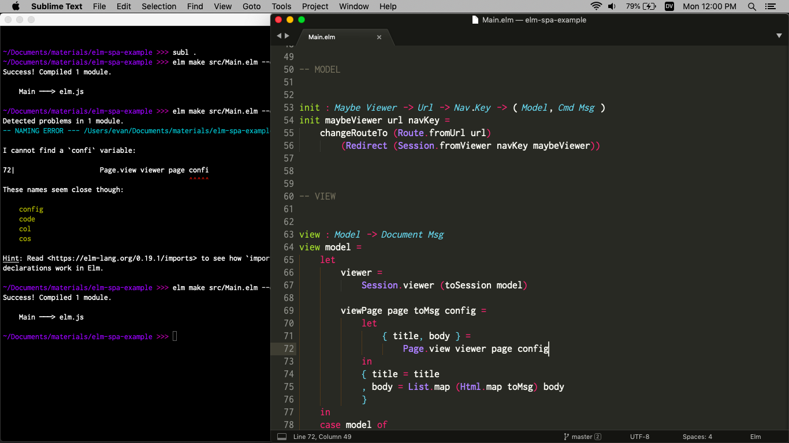

**NOT PUBLISHED YET / WORK IN PROGRESS**

# Elm Syntax Highlighting

Just add syntax highlighting for Elm.

For people who like simple editors.

## Install Instructions

- [Mac](install/mac.md)
- [Linux](install/linux.md)
- [Windows](install/windows.md)

## Recommended Workflow

I do all of my Elm development with Terminal and Sublime Text open next to each other like this:

I mostly focus on the code in Sublime Text.

When I am curious if things work, I switch to Terminal and run something like `elm make src/Main.elm` to see if I get any errors.

Then I switch back to Sublime Text and use **Ctrl-t** (or **Cmd-t** on Mac) to navigate to the relevant files and make any fixes.

* * *

I think this workflow has some underappreciated benefits:

1. **Fast:** I never have to wait for a slow editor. It just does syntax highlighting.
2. **Flexibile:** Building some projects needs more than an `elm make` call. Maybe you need to generate some files first or compile some JavaScript assets. I like that I can switch to a custom `./build.sh` script and keep using my existing workflow.
3. **Robust:** There is not a lot that can go wrong, so I do not need to spend any time messing with various integrations if there are changes in `elm`, `elm-test`, `elm-format`, etc.

I really love this balance, but I know some people want a bit more. So I made [`elm-format-shortcuts`](https://github.com/evancz/elm-format-shortcuts) for folks who want a keyboard shortcut for running `elm-format` on a file (or to run it on save).
