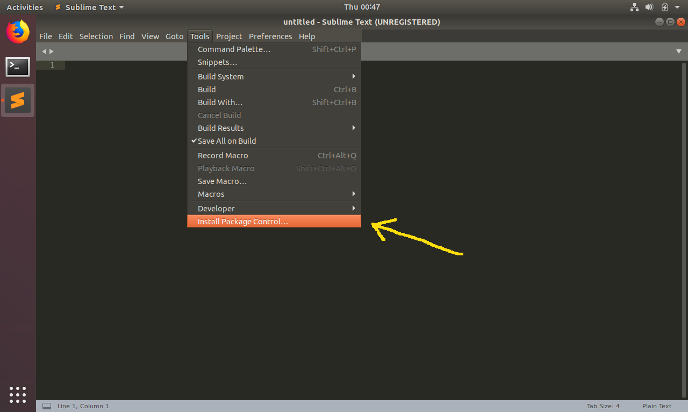
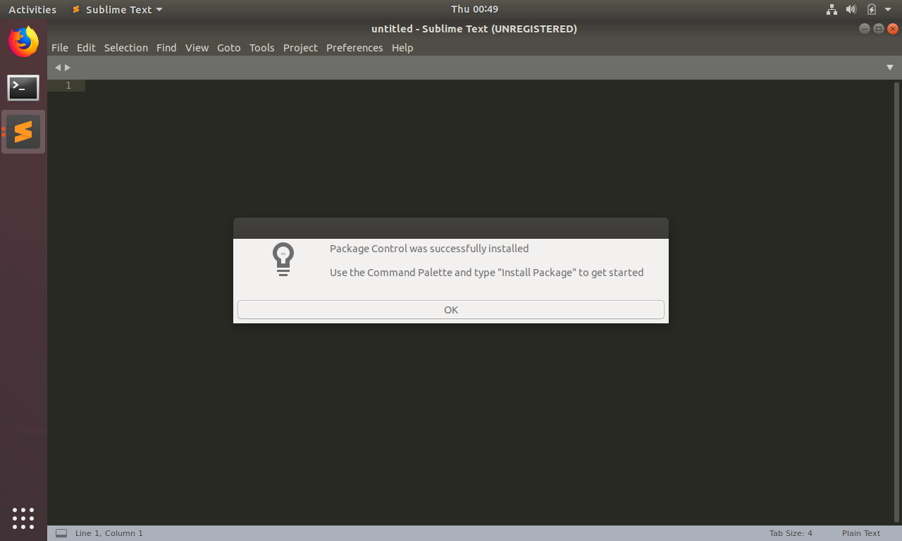
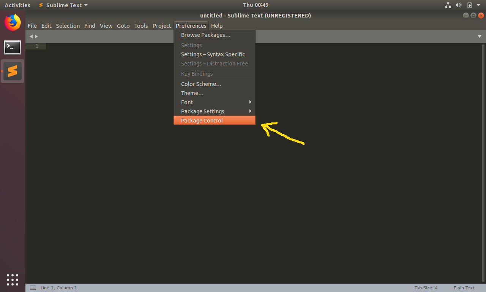
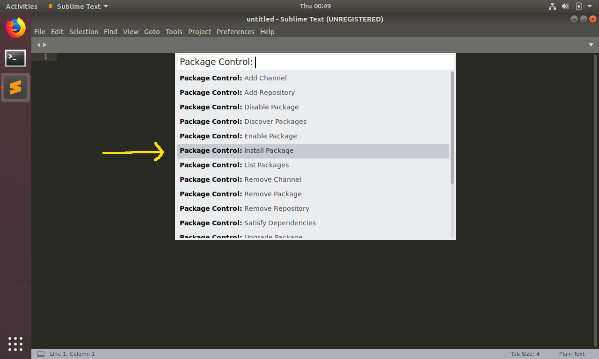
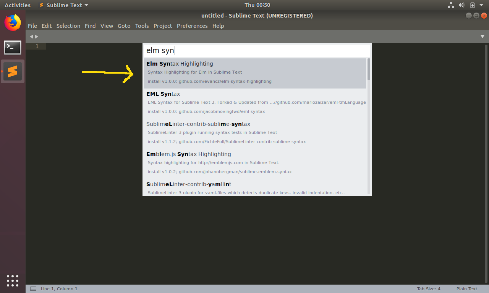

# Install on Linux

Editor plugins in Sublime Text are managed with a project called **Package Control**.

If you just installed Sublime Text, you will need to install Package Control first.

If you have been using Sublime Text for a while, you may be able to skip to step two.

## 1. Install Package Control

Open Sublime Text and go to **Tools > Install Package Control...**

Click on that! Next you should see a dialog box like this:

Click **OK**. Now you have **Package Control** available!

**Note:** If you cannot find **Tools > Install Package Control...**, it may be installed already. Try moving on to step two!

## 2. Install elm-syntax-highlighting with Package Control

With Sublime Text open, go to **Preferences > Package Control**

Click on that, and select **Install Package** from the list of options:

Type in **Elm Syntax Highlighting** and select the package that comes up:

## 3. Restart Sublime Text

Once you have **Elm Syntax Highlighting** installed, restart Sublime Text.

After restarting, files like `src/Main.elm` should have syntax highlighting!

**Note**: Be sure to ask in a [community forum](https://elm-lang.org/community) if you are having trouble getting this set up!
